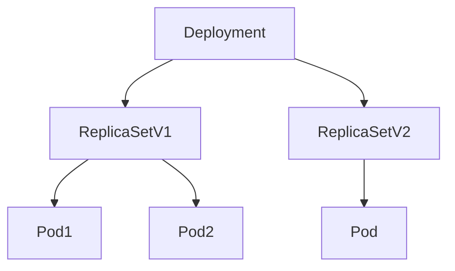

# Deployment

最常见的控制器，是一个两层控制器
类似的控制通常由两部分组成，上半部分控制器定义和下半部分被控制对象模板

[demo](../../../config/example/deployment/deployment.yaml)

编排的动作为确保 `app=nginx` 标签的 `Pod` 数量永远等于 `spec.replicas`

- 控制器从 `etcd` 中获取带有 `app-nginx` 标签的 `Pod` 个数，这个是实际状态
- `Deployment` 对象 `Replicas` 字段描述的是期望状态
- 两个状态进行比较，确定是删除还是创建

被控制的对象定义在 `template` 字段中，这个被称为 `PodTemplate`

### ReplicaSet

`ReplicaSet` 和滚动更新有关，可以升级现有容器
[demo](../../../config/example/deployment/replicaSet.yaml)

`ReplicaSet` 也是由副本定义和 `Pod` 模板组成
`Deployment` 控制器实际上操作的就是 `ReplicaSet` 对象，通过 `ReplicaSet` 控制器模式保证 `Pod` 个数
> `Deployment` 中的 `Pod` 只能设置为 `restartPolicy=Always`

### 滚动更新

将一个集群中正在运行的多个 `Pod` 版本，交替逐一升级的过程
新版本先扩容，旧版逐步缩容



### 回滚

```bash
kubectl rollout history deployment/nginx-deployment
deployment.apps/nginx-deployment 
REVISION  CHANGE-CAUSE
1         <none>

kubectl rollout undo deployment/nginx-deployment --to-revision=1
```