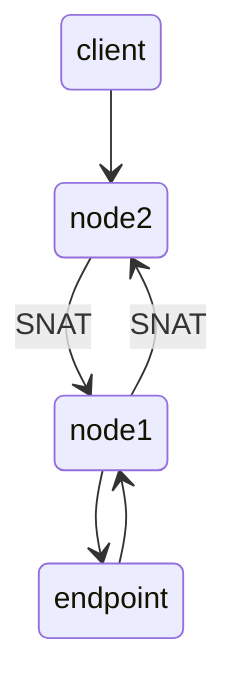
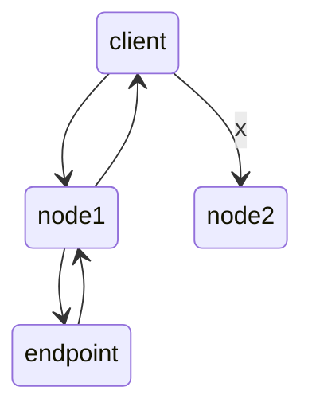

# Service

为 `Pod` 分配的基于 `iptables`(`IPVS`) 的访问入口，这些访问入口代理的 `Pod` 信息，来源与 `Etcd`

[service定义](../../../config/example/kubectl/service-host.yaml)

[deployment定义](../../../config/example/kubectl/deployment-host.yaml)

```bash
kubectl apply -f config/example/kubectl/service-host.yaml
kubectl apply -f config/example/kubectl/deployment-host.yaml

# 查看老接口
kubectl get endpoints
NAME        ENDPOINTS                                         AGE
hostnames   10.244.1.3:9376,10.244.1.4:9376,10.244.2.4:9376   10m
# 新方法
kubectl get endpointslice
```

只有处于 `Running` 状态并且通过 `readinessProbe` 检查的，才会出现在 `Service` 的 `endpoins` 中

```bash
kubectl get svc hostnames
NAME        TYPE        CLUSTER-IP     EXTERNAL-IP   PORT(S)   AGE
hostnames   ClusterIP   10.96.121.86   <none>        80/TCP    11m

kubectl apply -f config/example/kubectl/busybox.yaml 
kubectl exec -it busybox-7bfd4f9878-l4bnm -- sh
/ # wget -qO- http://hostnames
hostnames-64689b4446-p85lg
/ # wget -qO- http://hostnames
hostnames-64689b4446-mbqc6
/ # wget -qO- http://hostnames
hostnames-64689b4446-t6m5k
```

### Service 类型

`NodePort` 和 `LoadBalancer` 均基于 `ClusterIP` 增加外部访问能力

- `ClusterIP`
    - 仅集群内可访问
- `NodePort`
    - 每个节点开放静态端口
- `LoadBalancer`
    - 云厂商负载均衡器
- `ExternalName`
    - 映射到外部 `DNS` 名称

##### Service 选择器和端点

通过标签选择器确定后端 `Pod`，`k8s` 自动生成 `EndpointSlice` 记录所有匹配的 `Pod` 的 `IP`
无选择器的 `Service` 可以手动管理 `EndpointSlice`

##### 多端口和 Headless Service

支持多端口暴露，需要对每个端口命名
`Headless Service` 不提供统一的 `IP`，而是直接暴露所有后端 `Pod` 的 `IP`，适用于点对点连接的有状态应用

##### EndpointSlice

控制面板自动为带选择器的 `Service` 创建和维护 `EndpointSlice`，每个 `Slice` 包含一组端点的地址，端口和状态

### 流程

`Service` 是由 `kube-proxy` 组件，加上 `iptables` 来共同实现的

##### 入口

前面创建了名为 `hostnames` 的 `Service`，提交给 `k8s`，那么 `kube-proxy` 就可以通过 `Service` 的 `Informer` 感知到对象添加
作为对这个事件的响应，就会在宿主机上创建一条 `iptables`

```bash
iptables-save | grep 10.96.121.86
# 凡是 10.96.121.86 的 IP 包，都需要跳转到 KUBE-SVC-ODX2UBAZM7RQWOIU 的 iptables 链进行处理
# 这条规则，为这个 Service 设置了一个固定的入口地址
-A KUBE-SERVICES -d 10.96.121.86/32 -p tcp -m comment --comment "default/hostnames:default cluster IP" -m tcp --dport 80 -j KUBE-SVC-ODX2UBAZM7RQWOIU
-A KUBE-SVC-ODX2UBAZM7RQWOIU ! -s 10.244.0.0/16 -d 10.96.121.86/32 -p tcp -m comment --comment "default/hostnames:default cluster IP" -m tcp --dport 80 -j KUBE-MARK-MASQ
```

> `10.96.121.86` 只是一条规则，没有网络设备无法 ping 通，需要指定端口才能进行匹配

##### iptables 链

```bash
iptables-save | grep KUBE-SVC-ODX2UBAZM7RQWOIU
# 一组随机模式的 iptables 链
# 三条链指向的最终目的，其实就是这个 Service 代理的三个 Pod，这组规则也是 Service 实现负载均衡的位置
# probability 用来设置这条规则被选中的几率，第一条三分之一，第二条二分之一，第三条一
-A KUBE-SVC-ODX2UBAZM7RQWOIU -m comment --comment "default/hostnames:default -> 10.244.1.3:9376" -m statistic --mode random --probability 0.33333333349 -j KUBE-SEP-KQXJIRBK6P6QLVPN
-A KUBE-SVC-ODX2UBAZM7RQWOIU -m comment --comment "default/hostnames:default -> 10.244.1.4:9376" -m statistic --mode random --probability 0.50000000000 -j KUBE-SEP-ZIDLKAVZSENS4D6S
-A KUBE-SVC-ODX2UBAZM7RQWOIU -m comment --comment "default/hostnames:default -> 10.244.2.4:9376" -j KUBE-SEP-LQ76II2B65IPADN2
```

```bash
-A KUBE-SEP-KQXJIRBK6P6QLVPN -s 10.244.1.3/32 -m comment --comment "default/hostnames:default" -j KUBE-MARK-MASQ
-A KUBE-SEP-KQXJIRBK6P6QLVPN -p tcp -m comment --comment "default/hostnames:default" -m tcp -j DNAT --to-destination 10.244.1.3:9376

-A KUBE-SEP-LQ76II2B65IPADN2 -s 10.244.2.4/32 -m comment --comment "default/hostnames:default" -j KUBE-MARK-MASQ
-A KUBE-SEP-LQ76II2B65IPADN2 -p tcp -m comment --comment "default/hostnames:default" -m tcp -j DNAT --to-destination 10.244.2.4:9376

-A KUBE-SEP-ZIDLKAVZSENS4D6S -s 10.244.1.4/32 -m comment --comment "default/hostnames:default" -j KUBE-MARK-MASQ
-A KUBE-SEP-ZIDLKAVZSENS4D6S -p tcp -m comment --comment "default/hostnames:default" -m tcp -j DNAT --to-destination 10.244.1.4:9376
```

`DNAT`在路由检查之前，将流入 `IP` 包的目的地址和端口修改为 `–to-destination` 所指定的新的目的地址和端口
通过处理之后 `Service VIP` 的 `IP` 包被定位到访问某个具体的 `Pod` 包

### 网络策略

`NetworkPolict` 允许基于标签选择器定义 `Pod` 的网络访问规则，实现细颗粒的流量隔离

- `Ingress`
    - 入站流量控制
- `Engress`
    - 出站流量控制

### 双栈网络

可以同时分配 `IPv4` 和 `IPv6`

### IPVS 模式

`kube-proxy` 通过 `iptables` 处理 `Service` 的过程，需要在宿主机上设置 `iptables` 规则，同时还需要不断的刷新这些规则
这样会制约 `Pod` 的规模，使用 `IPVS` 可以解决这个问题

- `kube-proxy` 首先会在宿主机上创建一个虚拟网卡 `kube-ipvs0`
- 通过 `Linux` 上的 `IPVS` 模块，为这个 `IP` 地址设置三个 `IPVS` 虚拟主机
    - 使用轮询策略来进行负载均衡
- `IPVS` 并不需要在宿主机上为每个 `Pod` 设置 `iptables` 规则，而是把对这些放到了内核态处理，从而降低了维护

> `IPVS` 只负责代理和负载均衡，其他还是基于 `iptables`

### DNS

`Service` 和 `Pod` 都会被分配对应的 `DNS A` 记录，由 `kube-dns` 模块负责
> `DNS A` 记录，将域名解析为 `IP`

对于 `ClusterIP` 模式的 `Service` 来说，它的 `A` 记录格式为 `<serviceName>.<namespace>.svc.cluster.local`
，当访问这条记录，解析的就是该 `Service` 的 `VIP` 地址
对 `Headless Service`，它的 `A` 记录格式为 `<podName>.<serviceName>.<namesapce>.svc.cluster.local`
，访问记录时，返回的是所有被代理的 `Pod` 的 `IP` 地址的集合

##### Service DNS

普通的 `Service` 在 `my-service.my-namespace.svc.cluster.local` 生成 `A/AAA` 记录
`Headless Service` 为每个后端 `Pod` 生成独立记录

##### Pod DNS

可以通过 `dnsPolicy` 和 `dnsConfig` 字段配置 `Pod` 的 `DNS` 行为

- `Default`
    - 继承节点 `DNS` 配置
- `ClusterFirst`
    - 优先使用集群 `DNS`
- `ClusterFirstWithHostNet`
    - `hostNetwork Pod` 专用
- `None`
    - 忽略集群 `DNS` 设置

### Ingress 入口

用于将集群外部的 `HTTP/HTTPS` 流量路由到集群内 `Service`，支持基于主机名和路径的转发

##### 路径

`Ingress` 支持多种路径匹配方式

- `Prefix`
    - 按 `/` 分割的前缀匹配
- `Exact`
    - 精确的路径匹配
- `ImplementationSpecific`
    - 由 `IngressClass` 决定

### 访问方式

- `ClusterIP`
    - 通过集群内部的 `IP` 暴露服务，选择该值的服务只能在集群内部访问
    - 默认
- `NodePort`
    - 通过每个节点上的 `IP` 和静态端口 `NodePort` 暴露服务，可以在集群外面访问
        - `NodePort` 会路由到自动创建的 `ClusterIP` 服务
        - 请求 `<节点 IP>:<节点端口>`
- `LoadBalancer`
    - 云提供商的负载均衡器向外暴露的服务
    - 将流量路由到自动创建的 `NodePort` 和 `ClusterIP`
- `ExternalName`
    - 将服务映射到 `externalName` 字段的内容，无需创建任何类型的代理

##### ClusterIP

`Service` 的默认访问方式，根据是否生成 `ClusterIP` 分为 `Service` 和 `Headless Service`

普通 `Service` 通过为其分配一个集群内部可访问的固定虚拟 `IP`，实现集群内的访问

`Headless Service` 不会分配 `Cluster IP`，也不通过 `kube-proxy` 做反向代理或者负载均衡
通过 `DNS` 提供稳定的网络 `ID` 来访问，将 `endpoints` 直接解析为 `PodIP` 列表，主要给 `StatefulSet` 使用

##### NodePort

`Service` 定义中声明类型为 `type=NodePort`
[定义](../../../config/example/kubectl/service-nodeport.yaml)

```bash
kubectl apply -f config/example/kubectl/service-nodeport.yaml
kubectl apply -f config/example/kubectl/node-nodeport.yaml
kubectl get svc my-nginx
NAME       TYPE       CLUSTER-IP    EXTERNAL-IP   PORT(S)                        AGE
my-nginx   NodePort   10.96.173.9   <none>        8080:31025/TCP,443:30858/TCP   19s

kubectl get nodes -o wide
NAME                     STATUS   ROLES           AGE     VERSION   INTERNAL-IP   EXTERNAL-IP   OS-IMAGE                         KERNEL-VERSION   CONTAINER-RUNTIME
k8s-test-control-plane   Ready    control-plane   3h12m   v1.34.0   172.18.0.4    <none>        Debian GNU/Linux 12 (bookworm)   6.1.0-39-amd64   containerd://2.1.3
k8s-test-worker          Ready    <none>          3h12m   v1.34.0   172.18.0.2    <none>        Debian GNU/Linux 12 (bookworm)   6.1.0-39-amd64   containerd://2.1.3
k8s-test-worker2         Ready    <none>          3h12m   v1.34.0   172.18.0.3    <none>        Debian GNU/Linux 12 (bookworm)   6.1.0-39-amd64   containerd://2.1.3

```

访问

- `<ClusterIP>:<service.Port>`
    - `10.96.173.9:8080`
- `<NodeIP>:<NodePort>`
    - `172.18.0.4:31025`

```bash
iptables-save | grep my-nginx | grep 8080
# 指向一组随机模式的 iptables，和 ClusterIP 一致
-A KUBE-SERVICES -d 10.96.173.9/32 -p tcp -m comment --comment "default/my-nginx:http cluster IP" -m tcp --dport 8080 -j KUBE-SVC-SV7AMNAGZFKZEMQ4
-A KUBE-SVC-SV7AMNAGZFKZEMQ4 ! -s 10.244.0.0/16 -d 10.96.173.9/32 -p tcp -m comment --comment "default/my-nginx:http cluster IP" -m tcp --dport 8080 -j KUBE-MARK-MASQ
```



`NodePort` 模式下，`IP` 包离开宿主机发往目的 `Pod`，会对包做一次 `SNAT`

- 客户端通过 `node2` 访问一个 `Service`
- 负载均衡机制，`IP` 包被转发给 `node1`
- `node1` 处理完会安装包的源地址进行回复
    - 如果没有 `SNAT` 会出现问题，发送的和收到的回复不一致
- 使用 `SNAT` 将源地址改为 `node 2`，先回复给 `node 2`
- `node 2` 再发送给 `client`



`spec.externalTrafficPolicy=local` 流量只转发到真正存在 `Pod` 的节点，并且客户端源地址不会被 `SNAT`
`Pod` 可以直接使用源地址进行回复，`node 2` 访问将会变得无效

##### LoadBalancer

[案例](../../../config/example/kubectl/service-loadBalancer.yaml)

##### ExternalName

[案例](../../../config/example/kubectl/service-externalName.yaml)

本质上是在 `kube-dns` 添加一条 `CNAME` 记录